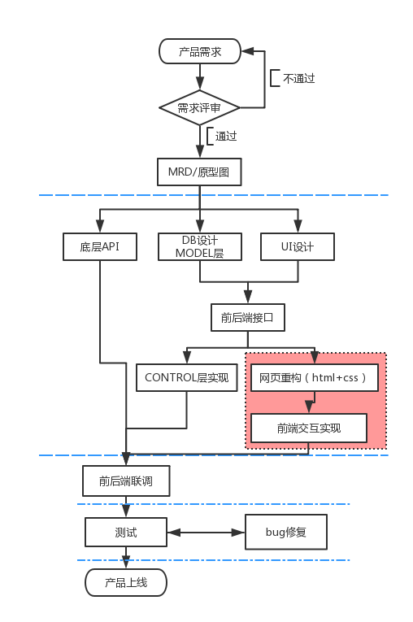

# seajs-init

sea.js项目初始化的脚手架，包括模板引擎，mock数据，项目发布部署的相关配置。该脚手架可以实现前后端分离，使前端人员开发脱离后端服务独立开发运行调试，思想类似于百度出品的[FIS](https://github.com/fex-team/fis3)。实现远离简单可配置，轻量易用。

## 初衷

* 前后端分离

  关于前后端分离的意义，有的人持否定意见，有的人持肯定意见，国外基本很少听到这个词，而国内基本认可的一个词。至于分离好还是不分离好，我认可前者。我给我自己的理由是：

  *  __术业有专攻：__ 铜匠做不了铁匠的事情，电工做不了木工的事情，如果一个人什么都做那只能是什么都不精。中国比较推崇的是一技之长，外国推崇综合素质，这种文化不同可能是受教育环境影响。
  *  __社会分工朝向专项化发展：__ 社会分工更明确才能保证工作高效进行，保证每个人所做的工作是自己所最擅长的工作，那效率是最高的，即使是full stack ,我相信他也会有倾向，即使是前端也会有喜欢些css不喜欢写js的人，所以为什么不把工作锁定在自己最擅长的地方发展呢。如果一个老板能把一个公司的所有工作都能胜任，为什么要分运营，会计，人事，研发呢。社会分工必然是向微型化，专项化发展。
  *  __前后端分离所带来的联调成本只能说我们还没有做好：__ 解决一个问题时时常会出现新的问题，这是历史必然的发展规律，当人们制作汽车作为交通工具时解决了人们远距离出行的问题，但会引起交通事故上升，大气污染等问题，但出现新的问题不代表人类制造汽车就不是进步了。这时候我们应该抱有遇到问题解决问题的思想，以科学发展观看待。直至现在很多技术架构师也没有真正解决这个联调带来的沟通成本问题，但是我觉得这个问题迟早会被解决，我坚信。别人不能不代表我不能。
  *  __前后端分离可以实现前后端并行开发：__ 并行开发是在保证了每个人在自己擅长的领域里做自己最高效的工作前提下，同时开发，并不像有些人说的要工作流阻塞等待。
  *  __促进工程师纵向发展__ 
  *  __更快的项目变化响应__  前端需求变动往往要多余后端变动，也就是后端RESTAPI可以完全SOA化，频繁的前端交互变化不影响SOA服务的变化，这种响应模式牵动的变化更小，变化可以更迅速
* 前端模块化

  前端复杂化导致web应用越来越大，模块化开发必然

* 前端工程化

  代码版本库可脱离后端服务代码单独管理，会带来一个新的问题就是前端代码的发布和部署


## 工作流程图



图中蓝色虚线内是任务并行阶段，红色部分为前端框架要处理的部分

## 安装

```
git clone https://github.com/shangxinbo/seajs-init.git youproject
cd youproject
npm install 
npm run start  //http://localhost:3000
```

## 脚本

`npm run start`

启动本地mock数据进行纯前端开发，在项目开发初期使用。假数据在 /api/ 目录下，目录结构和深度和商定的接口格式一致，如接口是/project/add，对应的假数据应在'/api/project/add.js'文件中 

`npm run dev`

启动本地服务代理真实数据来联调数据使用，在前后端开发基本完成后项目联调阶段使用

`npm run build` or `gulp`（npm install -g gulp）

发布可调式代码，用于发布到测试环境

`npm run release` or `gulp --release`

发布生产环境代码，会压缩并且加hash后缀，用于发布到预上线和线上环境

`gulp watch`

将less文件实时编译成css文件，用于网页重构阶段，其中start脚本和dev脚本已经包含了该命令

## 使用

#### 网页重构期

重构师将UI设计图切图并布局html编写css，这个过程中执行`gulp watch`可以实时编写html和less。静态资源全部放在/public目录下，html放在/html目录下，这两个目录作为这一工作阶段的产出。

#### 纯前端开发期

FE将上一阶段的产出html分解成view模板，并使用swig引擎将模板关系处理好，将上一阶段的静态资源无配置使用，js使用sea.js模块化编写。在研发过程中如果有RESTful API 调用，则按照接口的路径在/api目录添加对应的mock数据，使用mockjs产生随机字段。使用`npm run start`是这一阶段的主要命令，执行后，node服务开启，监听3000端口，在浏览器中输入 http://localhost:3000 即可开发调试。这一阶段的产出主要是/public/js主程序文件和/views中模板文件。

#### 和后端联调期

当前后端开发完毕后，需要联调，此时将代理的路径配置成后端可访问的URL，然后执行`npm run dev`，这时node会代理所有的RESTful请求到你的代理的目标路径，因为你的mock接口是和后端约定好的接口，所以直接切换即可联调，不需要做任何修改。关于代理路径配置请看//TODO

#### 测试阶段

当前后端联调完毕，需要将前端代码发布到测试服务器，此时执行将/config.json里的php_code_path字段配置成你要发布的路径，然后执行`npm run build` 即可将可调式代码发布到对应路径。这里建议将/config.json加入到.gitignore当中，保证每个人的本地路径不同不会影响其他人的配置。

#### 预上线和线上

同测试阶段一样，只是使用`npm run release`命令，此时css，js，html全部被压缩，css和js添加上hash后缀以防浏览器缓存，同时记录版本。


## 方案与依赖

- 借助express 实现轻量服务器，监听3000端口，为前端开发提供服务容器，这样做的好处是前端开发可以完全脱离后端服务，以保证前后端工作的并行实施
- 使用node 代理 RESTful API,其实最简单的方式就是使用目录结构描述API的路径，同时采用mockjs 产生随机数据保证数据的随机性达到高模仿性
- 使用swig 模板引擎达到静态html的模板分割，由于最终产出是html静态文件，所以没有使用后台程序的模板引擎，那么为了使用模板的继承性，引入swig来分割模板，达到维护的便利性。在调试环境中（纯前端研发阶段）node支持swig引擎，完美运行。发布阶段，借助gulp-swig将模板继承实现替换。产出纯的html页面。
- gulp生态组件是支撑这个脚手架的根本

## 配置

/config.json 项目发布目录，是本地的目录路径配置如下

```
{
  "php_code_path":"D:/php/public/static" 
}
```

如果使用该目录结构用于新项目，注意以下目录结构尽量不要变 
/bin 
/html   纯静态页，网页重构师工作的输出目录 
/api      mock数据 
/proxy 接口代理程序
/public 静态资源文件目录
/public/css  一般是第三方样式库
/public/img 
/public/js    主程序
/public/js/lib   第三方js类库
/public/js/seajs-config.js  sea.js的配置文件 
/public/less  自主编写的样式文件
/view             真实逻辑页面
/app.js          node 服务器入口
/config.json  被加入.gitignore 每个人在本地配置的发布路径


## 引用

[web 前后端分离的意义大吗?](https://www.zhihu.com/question/28207685)

[Web前后端分离开发思路](https://segmentfault.com/a/1190000002413526)

[淘宝前后端分离实践](http://2014.jsconf.cn/slides/herman-taobaoweb/#/)
